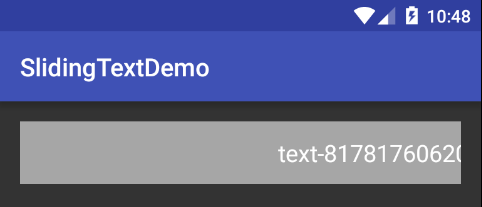
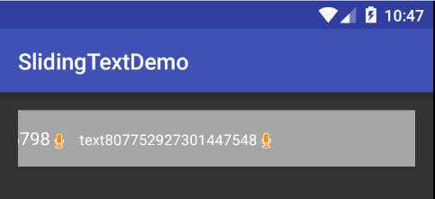

# Android-SlidingLayout
A flexible layout that slides out children views smoothly from right-most to left-most of the screen to achieve a "bullet curtain" effect

### With `SlidingLayout`, you can:
+ use any type of child `View`
+ configure `velocity`
+ adjust `divider size`




### Usage:
Simply invoke `SlidingLayout.enqueue(SlideItem)` and supply a `SlideItem`. `SlideItem.onCreateView()` will be called only when the item is about to be displayed. Off-screen items are queued in forms of `SlideItem` to avoid measure/layout overhead.

```java
mSlidingLayout.enqueue(new SlidingLayout.SlideItem() {
    @Override
    protected View onCreateView() {
        TextView tv = new TextView(MainActivity.this);
        SpannableStringBuilder ssb = new SpannableStringBuilder("text" + mRnd.nextLong());
        ssb.setSpan(new ImageSpan(MainActivity.this, android.R.drawable.presence_audio_away), ssb.length() - 1,
                ssb.length(), Spanned.SPAN_EXCLUSIVE_EXCLUSIVE);
        tv.setText(ssb);
        tv.setTextColor(Color.WHITE);
        tv.setTextSize(10 + mRnd.nextInt(10));
        return tv;
    }
});
```

License
-------

Copyright 2015 Yang Bo

Licensed under the Apache License, Version 2.0 (the "License");
you may not use this file except in compliance with the License.
You may obtain a copy of the License at

   http://www.apache.org/licenses/LICENSE-2.0

Unless required by applicable law or agreed to in writing, software
distributed under the License is distributed on an "AS IS" BASIS,
WITHOUT WARRANTIES OR CONDITIONS OF ANY KIND, either express or implied.
See the License for the specific language governing permissions and
limitations under the License.
